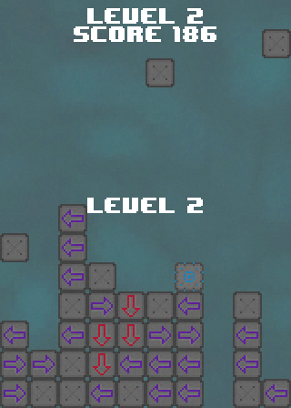

# Fall
A block stacking game inspired by Tetris.

[![PlayButton]](https://github.com/JeremyBankes/Fall/releases/download/Fall/Fall.jar)

[PlayButton]: https://img.shields.io/badge/Download_Fall-4A7376?style=for-the-badge

This project requires [Java 1.8+](https://java.com/en/download/) to run.

Made with ❤ by [Jeremy Bankes](https://jeremybankes.com)